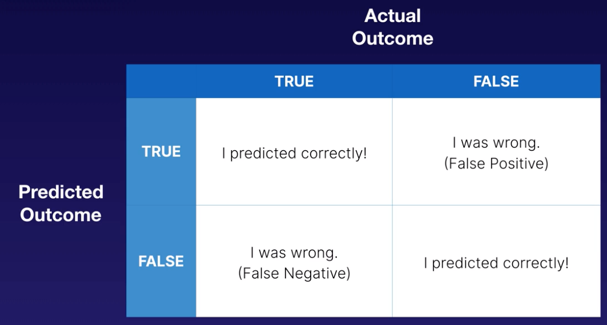

# Developing a good model

There are different ways to approach the problem:

Here are some examples of choosing the right approach

### Confusion Matrix

### Bloom's Taxonomy

### Data Preparation

### K-Fold Cross-Validation Method

### AWS Mechanical Turk

The name Mechanical Turk was inspired by "[The Turk](https://en.wikipedia.org/wiki/The_Turk)", an 18th-century chess-playing [automaton](https://en.wikipedia.org/wiki/Automaton) made by [Wolfgang von Kempelen](https://en.wikipedia.org/wiki/Wolfgang_von_Kempelen) that toured Europe, beating both [Napoleon Bonaparte](https://en.wikipedia.org/wiki/Napoleon_Bonaparte) and [Benjamin Franklin](https://en.wikipedia.org/wiki/Benjamin_Franklin). It was later revealed that this "machine" was not an automaton at all, but was, in fact, a human [chess master](https://en.wikipedia.org/wiki/Chess_master) hidden in the cabinet beneath the board and controlling the movements of a humanoid dummy. Likewise, the Mechanical Turk online service uses remote human labour hidden behind a computer interface to help employers perform tasks that are not possible using a true machine.

### Hyperparameters vs Parameters

### Why GPUs?

### Model design

1. Select a model that is a good fit for the objective
2. Choose the proper ML approach for your objective \(regression, binary classification, etc.\) \( you need to know about your algo and data\)
3. Choose proper evaluation strategies for your model based on your objective
4. Know the steps for training a model

### Data Preparation 

1. Understand concepts of Training Data and Testing Data
2. Identify potential biases introduced in an insufficient split strategy
3. Know when to use sequential splits versus randomized splits and what additional measures could be used to increase training data value. Sequential split is what we would use for time-series data. Perhaps we want to carve off the last 3 months as our test data sets. In other cases we would use randomized splits or k-fold to make sure we have good data for both training and test datasets.

### Model Training 

1. Multiple options for training: SageMaker Console, Apache Spark, Custom Code visa SDK, Jupyter Notebook
2. Be familiar with default data types SageMaker algorithms support and the recommended format for best performance 
3. Know the difference between a Hyper parameter and Parameter
4. understand the repository and container image concept for SageMaker training
5. Understand the process if you wish to provide your own algorithm
6. Understand the process for using Apache Spark to interact with SageMaker







